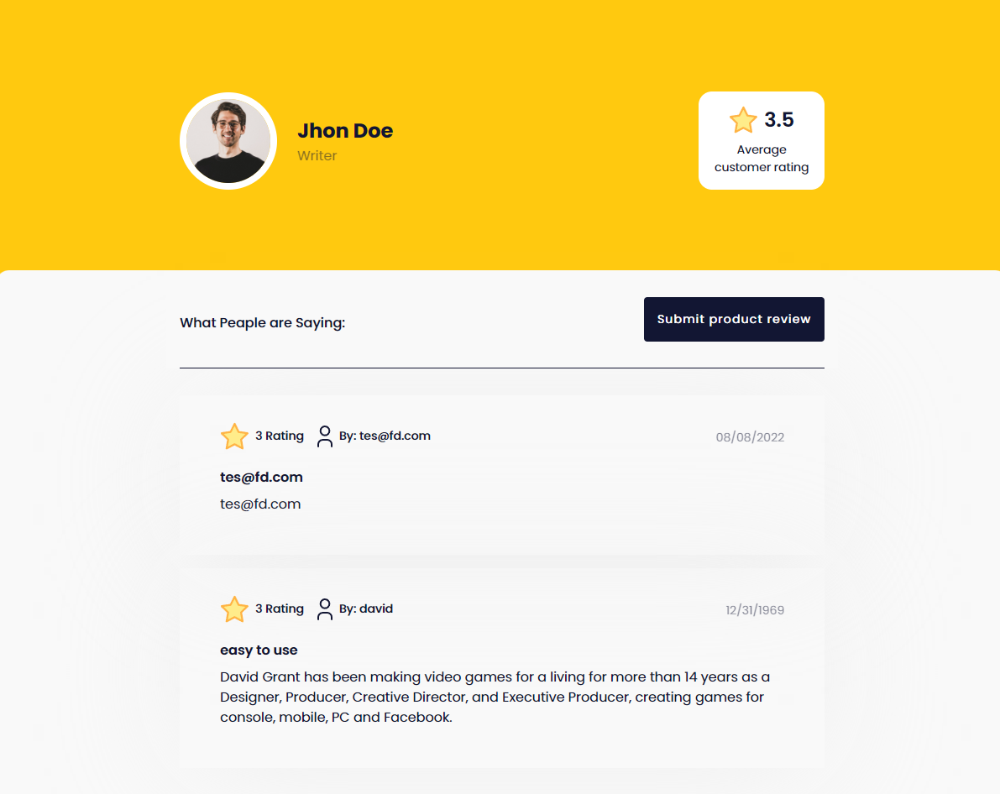
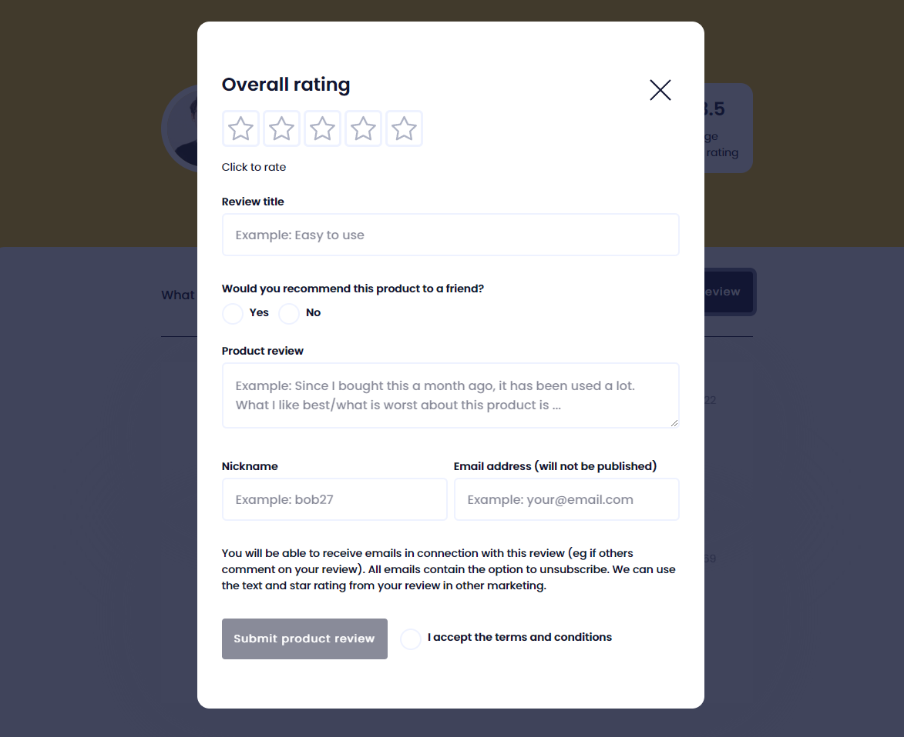

# overall-rating-client




## Sobre o Projeto

Este projeto é uma interface de armazenamento de comentários e feedback de clientes, a ideia é ter um formulário simples e uma interface bem limpa.


## Libs Usadas

- styled components 
- ferramenta para criar os componentes isolados da aplicação.


## Como Rodar

Depois de estar dentro do repositório:

```

npm start

# output - http://localhost:3000/

```
